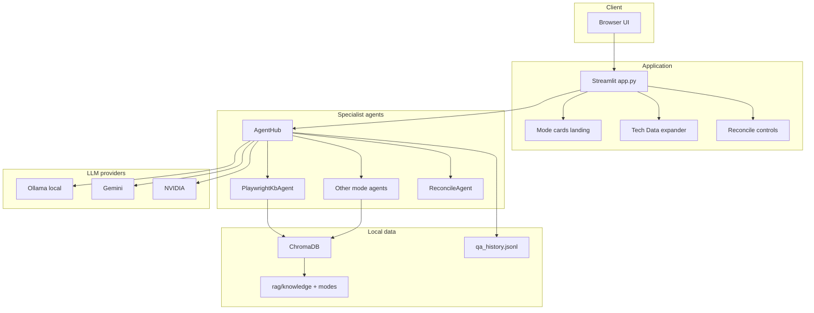
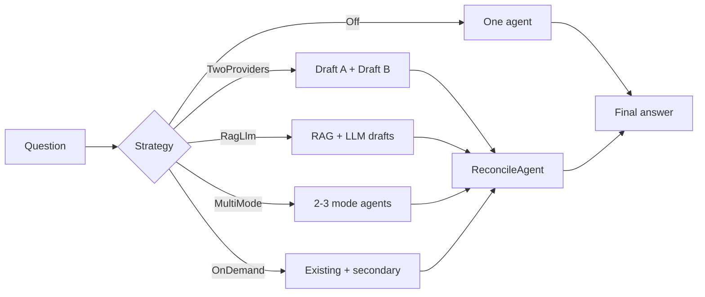

# Multi-mode Testing Hub — Architecture

NEW VISION / SoftServe hub: specialist agents, AI Reconcile, multi-provider LLM.

## System architecture

## Reconcile strategies

## Component map

| Layer | Component | Role |
|-------|-----------|------|
| UI | `app.py` | Mode cards, Tech Data, providers, reconcile, Mermaid |
| Hub | `rag/agents/hub.py` | Route modes + reconcile strategies |
| Agents | `rag/agents/specialists.py` | One class per mode |
| Reconcile | `rag/agents/reconcile.py` | Merge drafts into one answer |
| Providers | `rag/providers.py` | Ollama / Gemini / NVIDIA generate+stream |
| Diagram | `rag/diagram.py` | Mermaid extract/validate |
| Playwright | `rag/lc_pipeline.py` | Vector DB → LLM → internet cascade |
| Modes | `rag/modes.py` | Registry + knowledge paths |

## Related

- Runtime Playwright cascade: [workflow.md](./workflow.md)
- Setup: [../README.md](../README.md)
