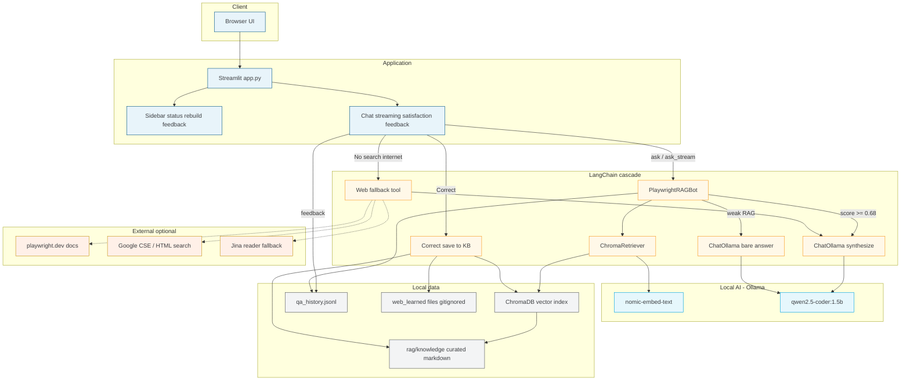
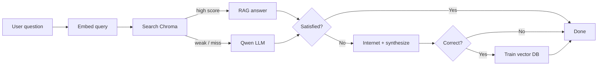

# Playwright Testing Chatbot — Architecture

NEW VISION / SoftServe local RAG assistant for Playwright testing.

## System architecture

## Request path (simplified)

## Component map

| Layer | Component | Role |
|-------|-----------|------|
| UI | `app.py` Streamlit | Chat, streaming, satisfaction, feedback, NEW VISION branding |
| Cascade | `rag/lc_pipeline.py` | Vector DB → Qwen → optional internet → KB train |
| LLM | LangChain `ChatOllama` | Local coding model `qwen2.5-coder:1.5b` |
| Embeddings | `nomic-embed-text` via Ollama | Query + document vectors |
| Vector DB | Chroma persistent | Playwright knowledge chunks |
| Knowledge | `rag/knowledge/*.md` | Curated docs (learned files gitignored) |
| History | `rag/history/qa_history.jsonl` | Q&A, feedback, Correct flags |
| Web | `rag/web_search.py` | Docs catalog / Google / Jina when user opts in |

## Modes returned by the bot

| Mode | Meaning |
|------|---------|
| `rag` | Strong vector-DB hit |
| `llm` / `llm_grounded` | Local Qwen answer |
| `internet` | User chose Not satisfied → web |
| `none` | No solid local answer yet |

## Related

- Runtime decision flow: [workflow.md](./workflow.md)
- Setup and privacy notes: [../README.md](../README.md)
