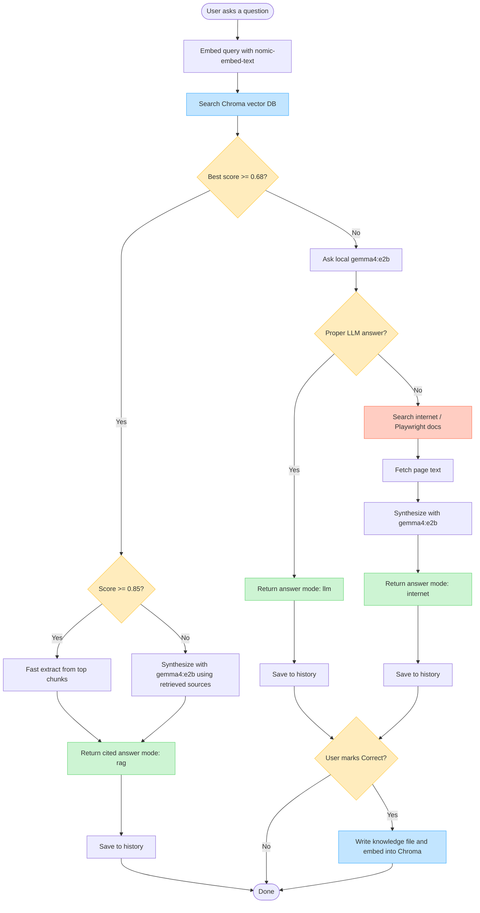

# Playwright Testing Chatbot — Workflow

## Cascade summary

1. **Vector DB (Chroma)** — retrieve Playwright knowledge  
2. **Ollama `gemma4:e2b`** — rewrite/synthesize from sources (skipped on very high similarity for speed)  
3. **Local LLM alone** — if RAG is weak  
4. **Internet** — if LLM has no proper answer  
5. **History → Correct** — only then train the knowledge base / vector DB  
