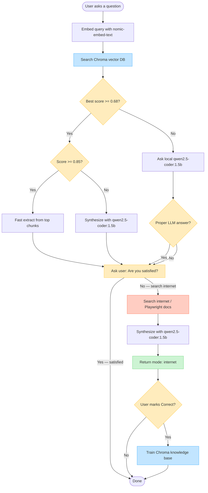

# Playwright Testing Chatbot — Workflow

## Cascade summary

1. **Vector DB (Chroma)** — retrieve Playwright knowledge  
2. **Ollama `qwen2.5-coder:1.5b` (LangChain)** — synthesize or answer if RAG is weak  
3. **Ask user** — Are you satisfied?  
4. **Internet** — only if the user clicks **No — search internet**  
5. **History → Correct** — only then train the knowledge base / vector DB  
