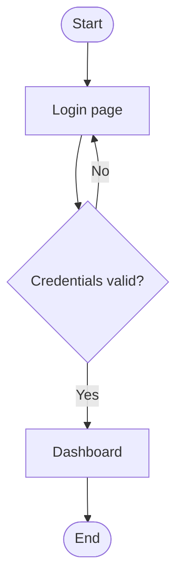

# Workflow diagram rules

Convert requirements into Mermaid `flowchart TD` or `LR`.

## Example

```mermaid
flowchart TD
  start([Start]) --> loginPage[Login page]
  loginPage --> auth{Credentials valid?}
  auth -->|Yes| dashboard[Dashboard]
  auth -->|No| loginPage
  dashboard --> endNode([End])
```

Node IDs: camelCase. Quote labels with spaces. No emojis in Mermaid.
